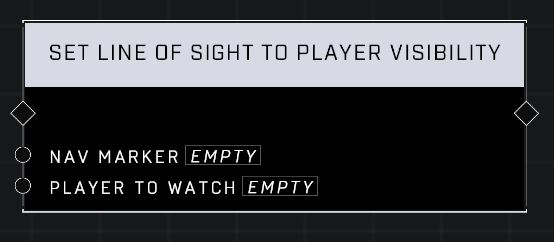

# Set Line Of Sight To Player Visibility

## Description
Sets or adds a visibility filter to Nav Marker that will pass for a player when that player has an unobstructed view of the other player or bot's head.

## Node Type
Nodes fall into two basic categories: Data and Execution. This node Executes a function directly in the node string.

## Inputs
| Input | Type | Required | Description |
|------------------|------------------|----------|--------------------------------------------------------------|
| Nav Marker | Nav Marker | Yes | Which nav marker is affected by this node. |
| Player To Watch | Player | Yes | Which player this node applies to. |

## Outputs
| Output | Type | Description |
|------------------|------------------|--------------------------------------------------------------|
| (none) | | |

\
\
**Contributors**

AddiCt3d 2CHa0s