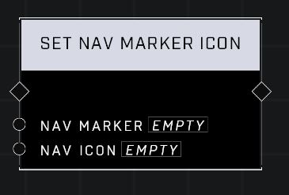

# Set Nav Marker Icon

## Description
Sets the icon of the Nav Marker

## Node Type
Nodes fall into two basic categories: Data and Execution. This node Executes a function directly in the node string.

## Inputs
| Input | Type | Required | Description |
|------------------|------------------|----------|--------------------------------------------------------------|
| Nav Marker | Nav Marker | Yes | Which nav marker is affected by this node. |
| Nav Icon | Nav Icon | No | Which icon to display on nav (Active Camo, Alpha, Attack, Bomb, Boss, Bravo, Charlie, Dead, Defend, Delta, Destroyed, Echo, Equipment, Flag, Foxtrot, Generic, Generic Arrow, Grenade, Hacking Terminal, KOTH, Kill, Oddball, Overshield, Power Seed, Quantum Translocator, Vehicle, Weapon). |

## Outputs
| Output | Type | Description |
|------------------|------------------|--------------------------------------------------------------|
| (none) | | |

\
\
**Contributors**

AddiCt3d 2CHa0s