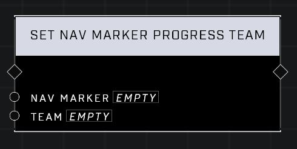

# Set Nav Marker Progress Team

## Description
Sets the Nav Marker's friendly team for progress updates. All other teams will see the progress color with their configured enemy color.

## Node Type
Nodes fall into two basic categories: Data and Execution. This node Executes a function directly in the node string.

## Inputs
| Input | Type | Required | Description |
|------------------|------------------|----------|--------------------------------------------------------------|
| Nav Marker | Nav Marker | Yes | Which nav marker is affected by this node. |
| Team | Team | Yes | Sets nav's team, affecting how players from friendly or enemy teams see it's color. |

## Outputs
| Output | Type | Description |
|------------------|------------------|--------------------------------------------------------------|
| (none) | | |

\
\
**Contributors**

AddiCt3d 2CHa0s