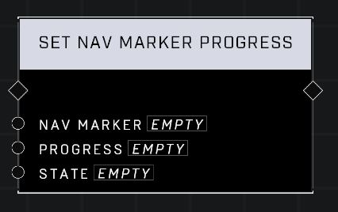

# Set Nav Marker Progress

## Description
Sets the Nav Marker Progress for the specified Bar Type if the current representation supports it.

## Node Type
Nodes fall into two basic categories: Data and Execution. This node Executes a function directly in the node string.

## Inputs
| Input | Type | Required | Description |
|------------------|------------------|----------|--------------------------------------------------------------|
| Nav Marker | Nav Marker | Yes | Which nav marker is affected by this node. |
| Progress | Number (0.00-1.00) | Yes | Sets percentage of progress. |
| State | Nav State | Yes | Sets State as Contested, Enemy, Friendly or Neutral. |

## Outputs
| Output | Type | Description |
|------------------|------------------|--------------------------------------------------------------|
| (none) | | |

\
\
**Contributors**

AddiCt3d 2CHa0s