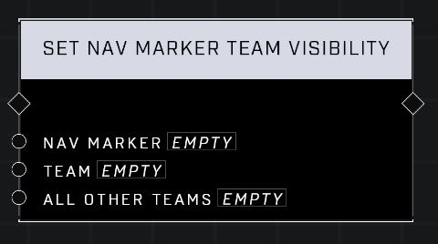

# Set Nav Marker Team Visibility

## Description
Hides the Nav Marker for players based on Team. If the All Other Teams input is false, the marker will only be visible to players on the Team. If it is true, the marker will be visible only to players NOT on the input team.

## Node Type
Nodes fall into two basic categories: Data and Execution. This node Executes a function directly in the node string.

## Inputs
| Input | Type | Required | Description |
|------------------|------------------|----------|--------------------------------------------------------------|
| Nav Marker | Nav Marker | Yes | Which nav marker is affected by this node. |
| Team | Team | Yes | Sets a team to affect visibility for the nav. |
| All Other Teams | Boolean | Yes | If true nav marker hides for all other teams and input team's current visibility is unaffected. If false nav marker hides for input team and other teams visibility is unaffected. |

## Outputs
| Output | Type | Description |
|------------------|------------------|--------------------------------------------------------------|
| (none) | | |

\
\
**Contributors**

AddiCt3d 2CHa0s