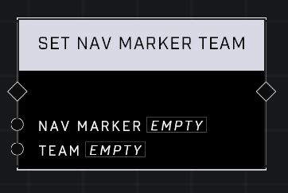

# Set Nav Marker Team

## Description
Sets the Nav Marker's associated Team. Players on the same team as the nav marker will see it as an allied marker, while players on other teams will see it as an enemy marker.

## Node Type
Nodes fall into two basic categories: Data and Execution. This node Executes a function directly in the node string.

## Inputs
| Input | Type | Required | Description |
|------------------|------------------|----------|--------------------------------------------------------------|
| Nav Marker | Nav Marker | Yes | Which nav marker is affected by this node. |
| Team | Team | Yes | Which team nav marker belongs to. |

## Outputs
| Output | Type | Description |
|------------------|------------------|--------------------------------------------------------------|
| (none) | | |

\
\
**Contributors**

AddiCt3d 2CHa0s