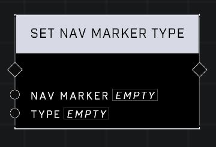

# Set Nav Marker Type

## Description
Sets Nav Marker's presentation to the Type. Some of the other Nav Marker related nodes work only with specific types. For instance, not all types support display text.

## Node Type
Nodes fall into two basic categories: Data and Execution. This node Executes a function directly in the node string.

## Inputs
| Input | Type | Required | Description |
|------------------|------------------|----------|--------------------------------------------------------------|
| Nav Marker | Nav Marker | Yes | Which nav marker is affected by this node. |
| Type | Nav Type | Yes | Sets nav type (Acquiring, Ally , Ally pulse, Arrow, Coop, Enemy, Enemy callout, Generic Objective, Item, Item pad, Location, Locked, Multiplayer Objective, Neutral, Waypoint). |

## Outputs
| Output | Type | Description |
|------------------|------------------|--------------------------------------------------------------|
| (none) | | |

\
\
**Contributors**

AddiCt3d 2CHa0s