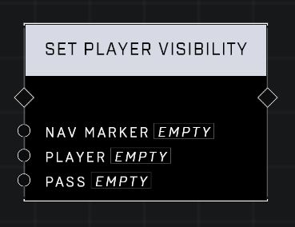

# Set Player Visibility

## Description
Shows or hides the Nav Marker for Player. Other filters might still influence Nav Marker's visibility.

## Node Type
Nodes fall into two basic categories: Data and Execution. This node Executes a function directly in the node string.

## Inputs
| Input | Type | Required | Description |
|------------------|------------------|----------|--------------------------------------------------------------|
| Nav Marker | Nav Marker | Yes | Which nav marker is affected by this node. |
| Player | Player | Yes | Which player to set visibility for. |
| Pass | Boolean | Yes | If true, nav marker is enabled for this player. If false, nav marker is not enabled for this player. |

## Outputs
| Output | Type | Description |
|------------------|------------------|--------------------------------------------------------------|
| (none) | | |

\
\
**Contributors**

AddiCt3d 2CHa0s