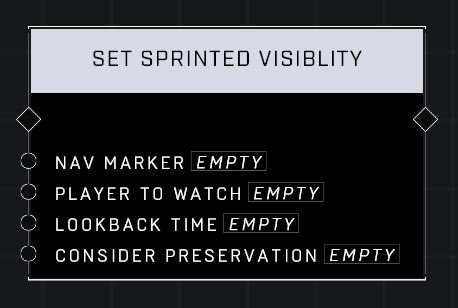

# Set Sprinted Visibility

## Description
Sets or adds a visibility filter to Nav Marker that will pass when a player has been sprinting within the lookback time in seconds. If Consider Preservation is true, then the filter will still pass if the player is not currently sprinting, but is instead performing some other action that keeps sprint active (eg bunny-hopping), which may be useful for preventing exploits.

## Node Type
Nodes fall into two basic categories: Data and Execution. This node Executes a function directly in the node string.

## Inputs
| Input | Type | Required | Description |
|------------------|------------------|----------|--------------------------------------------------------------|
| Nav Marker | Nav Marker | Yes | Which nav marker is affected by this node. |
| Player To Watch | Player | Yes | Which player to watch for sprinting visibility. |
| Lookback Time | Number | Yes | Sets a delay before sprinted visibility will kick in (0.00-10,000) |
| Consider Preservation | Boolean | Yes | Whether or not to count actions that persist fast player movement caused by sprinting as continued sprinting. |

## Outputs
| Output | Type | Description |
|------------------|------------------|--------------------------------------------------------------|
| (none) | | |

\
\
**Contributors**

AddiCt3d 2CHa0s