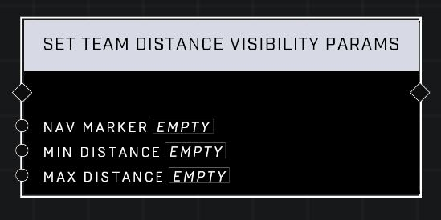

# Set Team Distance Visibility Params

## Description
Sets Nav Marker Team's Distance filter parameters.

## Node Type
Nodes fall into two basic categories: Data and Execution. This node Executes a function directly in the node string.

## Inputs
| Input | Type | Required | Description |
|------------------|------------------|----------|--------------------------------------------------------------|
| Nav Marker | Nav Marker | Yes | Which nav marker is affected by this node. |
| Min Distance | Number | Yes | Minimum distance from team that nav marker will display at (-1 - 10,000) |
| Max Distance | Number | Yes | Maximum distance from team that nav marker will display at (-1 - 10,000) |

## Outputs
| Output | Type | Description |
|------------------|------------------|--------------------------------------------------------------|
| (none) | | |

\
\
**Contributors**

AddiCt3d 2CHa0s