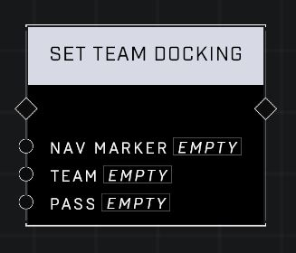

# Set Team Docking

## Description
Sets if Nav Marker displays docked or in the middle of the screen for Team.

## Node Type
Nodes fall into two basic categories: Data and Execution. This node Executes a function directly in the node string.

## Inputs
| Input | Type | Required | Description |
|------------------|------------------|----------|--------------------------------------------------------------|
| Nav Marker | Nav Marker | Yes | Which nav marker is affected by this node. |
| Team | Team | Yes | Which team this node affects. |
| Pass | Boolean | Yes | If true, docking is enabled for this team. If false, docking is not enabled for this team. |

## Outputs
| Output | Type | Description |
|------------------|------------------|--------------------------------------------------------------|
| (none) | | |

\
\
**Contributors**

AddiCt3d 2CHa0s