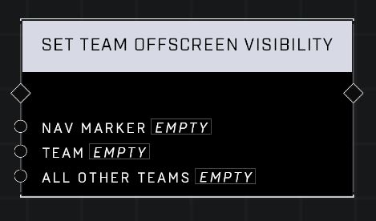

# Set Team Offscreen Visibility

## Description
Hides the Nav Marker when the navmarker is visually offscreen for players based on Team. If the All Other Teams input is false, the marker will only be visible offscreen to players on the Team. If it is true, the markers will be visible offscreen only to players NOT on the input team.

## Node Type
Nodes fall into two basic categories: Data and Execution. This node Executes a function directly in the node string.

## Inputs
| Input | Type | Required | Description |
|------------------|------------------|----------|--------------------------------------------------------------|
| Nav Marker | Nav Marker | Yes | Which nav marker is affected by this node. |
| Team | Team | Yes | Which team this node affects. |
| All Other Teams | Boolean | Yes | If true only attempts to hide nav for input team. If false, attampts to hide nav for all other teams except input team. |

## Outputs
| Output | Type | Description |
|------------------|------------------|--------------------------------------------------------------|
| (none) | | |

\
\
**Contributors**

AddiCt3d 2CHa0s