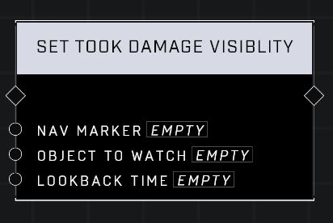

# Set Took Damage Visibility

## Description
Sets or adds a visibility filter to Nav Marker that wil pass when an object has taken damage within the lookback time in seconds.

## Node Type
Nodes fall into two basic categories: Data and Execution. This node Executes a function directly in the node string.

## Inputs
| Input | Type | Required | Description |
|------------------|------------------|----------|--------------------------------------------------------------|
| Nav Marker | Nav Marker | Yes | Which nav marker is affected by this node. |
| Object To Watch | Object | Yes | Which object to watch for taking damage. |
| Lookback Time | Number | Yes | Sets a delay before damage visibility will kick in (0.00-10,000) |

## Outputs
| Output | Type | Description |
|------------------|------------------|--------------------------------------------------------------|
| (none) | | |

\
\
**Contributors**

AddiCt3d 2CHa0s