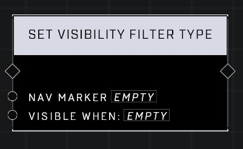

# Set Visibility Filter Type

## Description
Configures the Nav Marker's visibility filters such that either all of them must pass (the default) or that any of them must pass to show the nav marker.

## Node Type
Nodes fall into two basic categories: Data and Execution. This node Executes a function directly in the node string.

## Inputs
| Input | Type | Required | Description |
|------------------|------------------|----------|--------------------------------------------------------------|
| Nav Marker | Nav Marker | Yes | Which nav marker is affected by this node. |
| Visible When: | Visibility Filter | Yes | Whether nav will display if any or all visibility filters are true (Pass All, Pass Any). |

## Outputs
| Output | Type | Description |
|------------------|------------------|--------------------------------------------------------------|
| (none) | | |

\
\
**Contributors**

AddiCt3d 2CHa0s