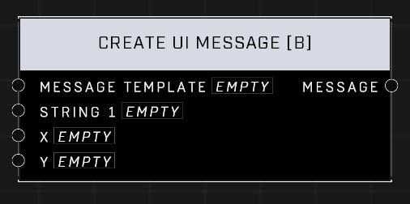

# Create UI Message \[B]

## Description
Creates a message string just as Create UI Message but with a different selection of templates. Numbers will always be rounded to the nearest integer.

## Node Type
Nodes fall into two basic categories: Data and Execution. This node supplies Data for an Execution node.

## Inputs
| Input | Type | Required | Description |
|------------------|------------------|----------|--------------------------------------------------------------|
| Message Template | Message Template | Yes | Which template message will use. |
| String 1 | String | Yes | The string to be used in this message template. |
| X | Number | Yes | A number to be used in this message template. |
| Y | Number | No | A number to be used in this message template. |

## Outputs
| Output | Type | Description |
|------------------|------------------|--------------------------------------------------------------|
| Message | String | The final string that will display for player. |

\
\
**Contributors**

AddiCt3d 2CHa0s