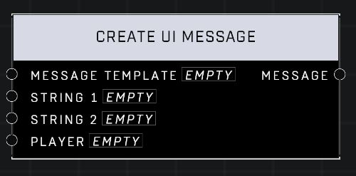

# Create UI Message

## Description
Pushes a splash banner with the Message to the Player's queue for the Duration in Seconds (2.5s minimum). Use the Create UI Message node to construct the Message.

## Node Type
Nodes fall into two basic categories: Data and Execution. This node supplies Data for an Execution node.

## Inputs
| Input | Type | Required | Description |
|------------------|------------------|----------|--------------------------------------------------------------|
| Message Template | Message Template | Yes | Which template message will use. |
| String 1 | String | Yes | A string to be used in this message template. |
| String 2 | String | No | A string to be used in this message template. |
| Player | Player | No | A player's name to be used in this message template. |

## Outputs
| Output | Type | Description |
|------------------|------------------|--------------------------------------------------------------|
| Message | String | The final string that will display for player. |

\
\
**Contributors**

AddiCt3d 2CHa0s