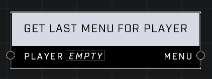

# Get Last Menu For Player

## Description
Returns the last _Menu_ that has been shown to a _Player_.  

## Node Type
Nodes fall into two basic categories: Data and Execution. This node supplies Data for an Execution node.

## Inputs
| Input | Type | Required | Description |
|------------------|------------------|----------|--------------------------------------------------------------|
| Player | Player | Yes | Which player to get last menu for. |

## Outputs
| Output | Type | Description |
|------------------|------------------|--------------------------------------------------------------|
| Menu | Menu | Which Menu player opened last |

\
\
**Contributors**

AddiCt3d 2CHa0s \
Okom \
Jordan9232