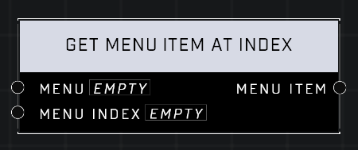

# Get Menu Item At Index

## Description
Gets the **Menu Item** in the given **Menu** at the given _Index_.  

## Node Type
Nodes fall into two basic categories: Data and Execution. This node supplies Data for an Execution node.

## Inputs
| Input | Type | Required | Description |
|------------------|------------------|----------|--------------------------------------------------------------|
| Menu | Menu | Yes | Which Menu to get Menu Item from. |
| Menu Index | Number | Yes | The index of the Menu Item to get. |

## Outputs
| Output | Type | Description |
|------------------|------------------|--------------------------------------------------------------|
| Menu Item | Menu Item | The Menu Item found at the given index. |

\
\
**Contributors**

AddiCt3d 2CHa0s \
Okom \
Jordan9232