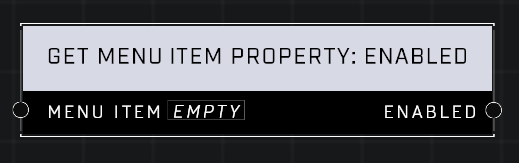

# Get Menu Item Property: Enabled

## Description
Gets **Menu Item**’s enabled state. If disabled, it will show a disabled visual state and not trigger an event on activation.  

## Node Type
Nodes fall into two basic categories: Data and Execution. This node supplies Data for an Execution node.

## Inputs
| Input | Type | Required | Description |
|------------------|------------------|----------|--------------------------------------------------------------|
| Menu Item | Menu Item | Yes | Which menu item to get property from. |

## Outputs
| Output | Type | Description |
|------------------|------------------|--------------------------------------------------------------|
| Enabled | Boolean | TRUE if Menu is enabled, FALSE if not. |

\
\
**Contributors**

AddiCt3d 2CHa0s \
Okom \
Jordan9232