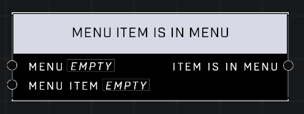

# Menu Item Is In Menu

## Description
Returns true if the **Menu Item** is in the given **Menu**.  

## Node Type
Nodes fall into two basic categories: Data and Execution. This node supplies Data for an Execution node.

## Inputs
| Input | Type | Required | Description |
|------------------|------------------|----------|--------------------------------------------------------------|
| Menu | Menu | Yes | Which menu to check for Menu Item. |
| Menu Item | Menu Item | Yes | Which menu item to check if it's in given Menu. |

## Outputs
| Output | Type | Description |
|------------------|------------------|--------------------------------------------------------------|
| Item Is In Menu | Boolean | TRUE if Item is in Menu, FALSE if not. |

\
\
**Contributors**

AddiCt3d 2CHa0s \
Okom \
Jordan9232