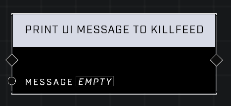

# Print UI Message To Killfeed

## Description
Prints the _UI Message_ in the killfeed of all players.  

## Node Type
Nodes fall into two basic categories: Data and Execution. This node Executes a function directly in the node string.

## Inputs
| Input | Type | Required | Description |
|------------------|------------------|----------|--------------------------------------------------------------|
| Message | String | Yes | Any message output pin plugs in here to display for player. |

## Outputs
| Output | Type | Description |
|------------------|------------------|--------------------------------------------------------------|
| (none) | | |

\
\
**Contributors**

AddiCt3d 2CHa0s \
Okom \
Jordan9232