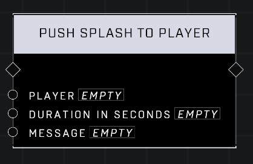

# Push Splash To Player

## Description
Pushes a splash banner with the Message to the Player's queue for the Duration in Seconds (2.5s minimum). Use the Create UI Message node to construct the Message.

## Node Type
Nodes fall into two basic categories: Data and Execution. This node Executes a function directly in the node string.

## Inputs
| Input | Type | Required | Description |
|------------------|------------------|----------|--------------------------------------------------------------|
| Player | Player | Yes | Which player to push splash for. |
| Duration In Seconds | Number | No | How many seconds splash will display for (2.5 minimum). |
| Message | String | Yes | A Create Message node plugs in here to display for player. |

## Outputs
| Output | Type | Description |
|------------------|------------------|--------------------------------------------------------------|
| (none) | | |

\
\
**Contributors**

AddiCt3d 2CHa0s