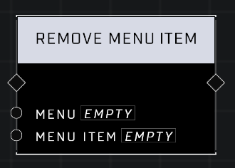

# Remove Menu Item

## Description
Removes all instances of a _Menu Item_ from a _Menu_.  

## Node Type
Nodes fall into two basic categories: Data and Execution. This node Executes a function directly in the node string.

## Inputs
| Input | Type | Required | Description |
|------------------|------------------|----------|--------------------------------------------------------------|
| Menu | Menu | Yes | Which menu to remove Menu Item from. |
| Menu Item | Menu Item | Yes | Which menu item to remove. |

## Outputs
| Output | Type | Description |
|------------------|------------------|--------------------------------------------------------------|
| (none) | | |

\
\
**Contributors**

AddiCt3d 2CHa0s \
Okom \
Jordan9232