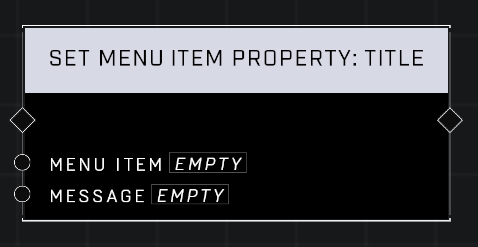

# Set Menu Item Property: Title

## Description
Sets **Menu Item**’s _Title_ text to the _Message_ created with one of the ‘Create UI Message’ nodes.  

## Node Type
Nodes fall into two basic categories: Data and Execution. This node Executes a function directly in the node string.

## Inputs
| Input | Type | Required | Description |
|------------------|------------------|----------|--------------------------------------------------------------|
| Menu Item | Menu Item | Yes | Which menu item to set property of. |
| Message | String | Yes | What message to use to set as the property. |

## Outputs
| Output | Type | Description |
|------------------|------------------|--------------------------------------------------------------|
| (none) | | |

\
\
**Contributors**

AddiCt3d 2CHa0s \
Okom \
Jordan9232