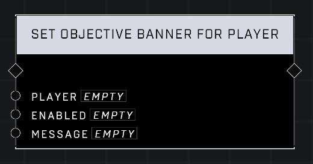

# Set Objective Banner For Player

## Description
Enables or disables a custom Objective Banner for the Player. When Enabled, the contents of the Message will be displayed. Use a Create UI Message node to construct a Message.

## Node Type
Nodes fall into two basic categories: Data and Execution. This node Executes a function directly in the node string.

## Inputs
| Input | Type | Required | Description |
|------------------|------------------|----------|--------------------------------------------------------------|
| Player | Player | Yes | Which player to set objective banner for. |
| Enabled | Boolean | Yes | If TRUE, banner will display. If FALSE, banner will hide. |
| Message | String | Yes | A Create Message node plugs in here to display for player. |

## Outputs
| Output | Type | Description |
|------------------|------------------|--------------------------------------------------------------|
| (none) | | |

\
\
**Contributors**

AddiCt3d 2CHa0s