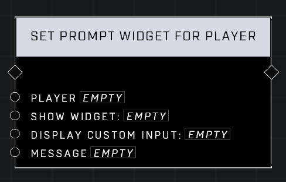

# Set Prompt WIdget For Player

## Description
Shows/hides and populates the prompt widget for _Player_. If _Display Custom Input_ is Tap or Hold, then the widget will show an icon corresponding to the player’s custom input button and it will assume that the mode uses the custom input in the way specified.  

## Node Type
Nodes fall into two basic categories: Data and Execution. This node Executes a function directly in the node string.

## Inputs
| Input | Type | Required | Description |
|------------------|------------------|----------|--------------------------------------------------------------|
| Player | Player | Yes | Which player to set widget for |
| Show Widget | Boolean | Yes | Sets whether or not widget is visible. |
| Display Custom Input | Boolean | Yes | Sets whether or not custom input displays. |
| Message | String | Yes | What message to use for the widget. |

## Outputs
| Output | Type | Description |
|------------------|------------------|--------------------------------------------------------------|
| (none) | | |

\
\
**Contributors**

AddiCt3d 2CHa0s \
Okom \
Jordan9232