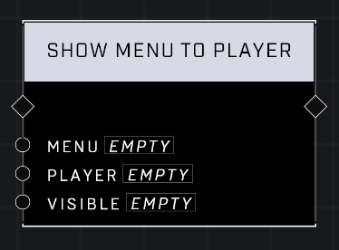

# Show Menu To Player

## Description
Shows or hides the _Menu_ to a given _Player_.  

## Node Type
Nodes fall into two basic categories: Data and Execution. This node Executes a function directly in the node string.

## Inputs
| Input | Type | Required | Description |
|------------------|------------------|----------|--------------------------------------------------------------|
| Menu | Menu | Yes | Which menu to show or hide for player. |
| Player | Player | Yes | Which player to show or hide menu for. |
| Visible | Boolean | Yes | Sets whether or not Menu is visible. |

## Outputs
| Output | Type | Description |
|------------------|------------------|--------------------------------------------------------------|
| (none) | | |

\
\
**Contributors**

AddiCt3d 2CHa0s \
Okom \
Jordan9232