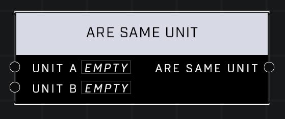

# Are Same Unit

## Description
Returns true if the two objects are the same unit, or if they are both invalid units.

## Node Type
Nodes fall into two basic categories: Data and Execution. This node supplies Data for an Execution node.

## Inputs
| Input | Type | Required | Description |
|------------------|------------------|----------|--------------------------------------------------------------|
| Unit A | Object | Yes | A unit to compare to other pin. |
| Unit B | Object | Yes | A unit to compare to other pin. |

## Outputs
| Output | Type | Description |
|------------------|------------------|--------------------------------------------------------------|
| Are Same Unit | Boolean | Outputs true or false if both are same unit. |

\
\
**Contributors**

AddiCt3d 2CHa0s