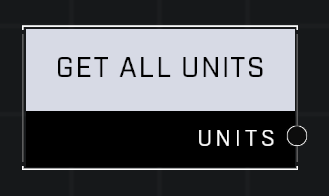

# Get All Units

## Description
Returns a list of all Units. Ai units will be at the end of the list

## Node Type
Nodes fall into two basic categories: Data and Execution. This node supplies Data for an Execution node.

## Inputs
| Input | Type | Required | Description |
|------------------|------------------|----------|--------------------------------------------------------------|
| (none) | |  |

## Outputs
| Output | Type | Description |
|------------------|------------------|--------------------------------------------------------------|
| Units | Object List | Outputs an object list of all units in the game. |

\
\
**Contributors**

AddiCt3d 2CHa0s