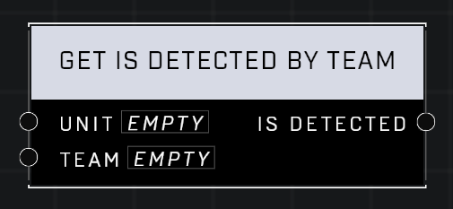

# Get Is Detected By Team

## Description
Returns true if the Unit is highlighted by a Threat Sensor or Threat Seeker belonging to the Team. AI units have to be on a non-neutral team to be detected.

## Node Type
Nodes fall into two basic categories: Data and Execution. This node supplies Data for an Execution node.

## Inputs
| Input | Type | Required | Description |
|------------------|------------------|----------|--------------------------------------------------------------|
| Unit | Object | Yes | Which unit to check status of. |
| Team | Team | Yes | Which team to check if is detecting the unit. |

## Outputs
| Output | Type | Description |
|------------------|------------------|--------------------------------------------------------------|
| Is Detected | Boolean | Outputs true or false. |

\
\
**Contributors**

AddiCt3d 2CHa0s