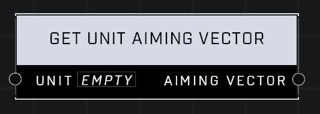

# Get Unit Aiming Vector

## Description
Returns the Unit's aiming vector. Returns global forward if the Unit is invalid.

## Node Type
Nodes fall into two basic categories: Data and Execution. This node supplies Data for an Execution node.

## Inputs
| Input | Type | Required | Description |
|------------------|------------------|----------|--------------------------------------------------------------|
| Unit | Object | Yes | Which unit to check aiming vector for. |

## Outputs
| Output | Type | Description |
|------------------|------------------|--------------------------------------------------------------|
| Aiming Vector | Vector3 | Outputs unit's aiming vector. |

\
\
**Contributors**

AddiCt3d 2CHa0s