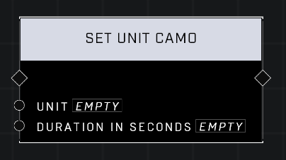

# Set Unit Camo

## Description
Enables active camo on the Unit for the Duration in Seconds. Warning! This node has limited duration. For non-AI units, it's better to apply a trait set using Trait: VFX - Active Camouflage to avoid these lilmitations.

## Node Type
Nodes fall into two basic categories: Data and Execution. This node Executes a function directly in the node string.

## Inputs
| Input | Type | Required | Description |
|------------------|------------------|----------|--------------------------------------------------------------|
| Unit | Object | Yes | Which unit to check team for. |
| Duration | Number | Yes | How many seconds unit's camo will last. |

## Outputs
| Output | Type | Description |
|------------------|------------------|--------------------------------------------------------------|
| (none) | | |

\
\
**Contributors**

AddiCt3d 2CHa0s