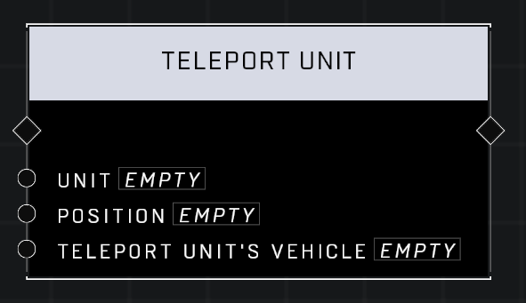

# Teleport Unit

## Description
Teleports a Unit to an absolute Position, optionally bringing their vehicle along

## Node Type
Nodes fall into two basic categories: Data and Execution. This node Executes a function directly in the node string.

## Inputs
| Input | Type | Required | Description |
|------------------|------------------|----------|--------------------------------------------------------------|
| Unit | Object | Yes | Which unit to teleport. |
| Position | Vector3 | Yes | World position to teleport Unit to. |
| Teleport Unit's Vehicle | Boolean | Yes | Whether or not to also teleport unit's vehicle if they're in one. |

## Outputs
| Output | Type | Description |
|------------------|------------------|--------------------------------------------------------------|
| (none) | | |

\
\
**Contributors**

AddiCt3d 2CHa0s