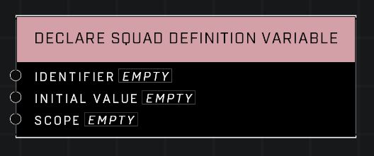
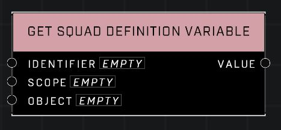
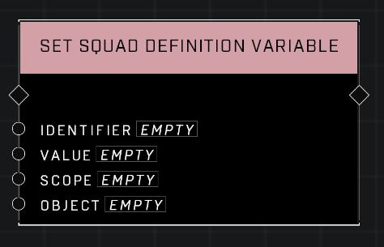

# Squad Definition Variable

#All variables require a Declare

Each Variable type has a Declare, a Set, and a Get node. Variables must be declared to be recognized by their get and set nodes, which must use the same custom identifier and scope. See infos for all three below.


## Declare Squad Definition Variable

## Description
Declare an Squad Definition variable with a custom Identifier. Variable declarations do not require an event node to trigger. They are automatically performed when the node graph script is run.

## Node Type
Nodes fall into two basic categories: Data and Execution. This node Executes a function when the game loads.

## Inputs
| Input | Type | Required | Description |
|------------------|------------------|----------|--------------------------------------------------------------|
| Identifier | String | Yes | The custom string id for this variable. |
| Initial Value | Squad Definition | No | What the variable holds when the game starts. |
| Scope | Scope | Yes | Local scope can only be accessed within the same script brain. Global and Object can be accessed by any script brain. Object scoped variables use the Object pin, to associate the variable with an object in the game.|

## Outputs
| Output | Type | Description |
|------------------|------------------|--------------------------------------------------------------|
| (none) |  |  |

---
 

## Get Squad Definition Variable

## Description
Get the Squad Definition variable stored with the matching Identifier in the matching Scope. The Object pin is only used when accessing the Object scope.

## Node Type
Nodes fall into two basic categories: Data and Execution. This node supplies Data for an Execution node.

## Inputs
| Input | Type | Required | Description |
|------------------|------------------|----------|--------------------------------------------------------------|
| Identifier | String | Yes | The custom string id for this variable. |
| Scope | Scope | Yes | Must match scope of declared variable with the same identifier.|
| Object | Object | No | Used to associate variable with an object when Object scope is used. |

## Outputs
| Output | Type | Description |
|------------------|------------------|--------------------------------------------------------------|
| Value | Squad Definition | Current value of this variable. |

---
 

## Set Squad Definition Variable

## Description
Set the Squad Definition variable stored with the matching Identifier in the matching Scope. The Object pin is only used when accessing the Object scope.

## Node Type
Nodes fall into two basic categories: Data and Execution. This node Executes a function directly in the node string.

## Inputs
| Input | Type | Required | Description |
|------------------|------------------|----------|--------------------------------------------------------------|
| Identifier | String | Yes | The custom string id for this variable. |
| Value | Squad Definition | Yes | The new value for this variable. |
| Scope | Scope | Yes | Must match scope of declared variable with the same identifier.|
| Object | Object | No | Used to associate variable with an object when Object scope is used. |

## Outputs
| Output | Type | Description |
|------------------|------------------|--------------------------------------------------------------|
| (none) |  |  |

\
\
**Contributors**

AddiCt3d 2CHa0s