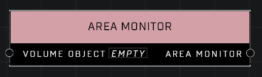

# Area Monitor

## Description
Creates an Area Monitor attached to the monitor object that acts as a trigger volume. Creates a monitor object by adding a Boundary configuration in the Object Properties menu to any dynamic object.

## Node Type
Nodes fall into two basic categories: Data and Execution. This node supplies Data for an Execution node.

## Inputs
| Input | Type | Required | Description |
|------------------|------------------|----------|--------------------------------------------------------------|
| Volume Object | Volume Object | Yes | Object with a boundary that will be used for the area monitor. |

## Outputs
| Output | Type | Description |
|------------------|------------------|--------------------------------------------------------------|
| Area Monitor | Area Monitor | Outputs the boundary as an Area Monitor. |