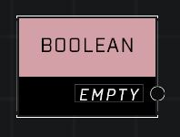

# Boolean

## Description
Stores a TRUE or FALSE value

## Node Type
Nodes fall into two basic categories: Data and Execution. This node supplies Data for an Execution node.

## Inputs
| Input | Type | Required | Description |
|------------------|------------------|----------|--------------------------------------------------------------|
| (none) |  |  |  |

## Outputs
| Output | Type | Description |
|------------------|------------------|--------------------------------------------------------------|
| True/False | Boolean | Current value of this node. |