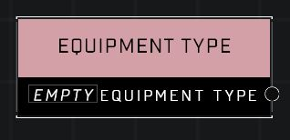

# Equipment Type

## Description
Stores an Equipment Type value such as Grappleshot or Active Camo. If you want to store a reference to a specific equipment instance, use an Object Reference variable instead.

## Node Type
Nodes fall into two basic categories: Data and Execution. This node supplies Data for an Execution node.

## Inputs
| Input | Type | Required | Description |
|------------------|------------------|----------|--------------------------------------------------------------|
| (none) |  |  |  |

## Outputs
| Output | Type | Description |
|------------------|------------------|--------------------------------------------------------------|
| Equipment Type | Equipment Type | Current value of this node. See Equipment Type page for more info. |