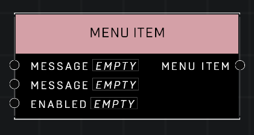

# Menu Item

## Description
Stores a **Menu Item** literal. This can only be used to set a **Menu Item** variable.  

## Node Type
Nodes fall into two basic categories: Data and Execution. This node supplies Data for an Execution node.

## Inputs
| Input | Type | Required | Description |
|------------------|------------------|----------|--------------------------------------------------------------|
| Message | String | No | Plug a message pin in to display for this Menu Item. |
| Message | String | No | Plug a message pin in to display for this Menu Item. |
| Enabled | Boolean | Yes | Determines whether or not this Menu Item is enabled. |

## Outputs
| Output | Type | Description |
|------------------|------------------|--------------------------------------------------------------|
| Menu Item | Menu Item | Outputs this Menu Item with it's settings. |

\
\
**Contributors**

AddiCt3d 2CHa0s \
Okom \
Jordan9232