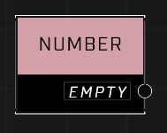

# Number

## Description
Stores a singler integer or floating point value

## Node Type
Nodes fall into two basic categories: Data and Execution. This node supplies Data for an Execution node.

## Inputs
| Input | Type | Required | Description |
|------------------|------------------|----------|--------------------------------------------------------------|
| (none) |  |  |  |

## Outputs
| Output | Type | Description |
|------------------|------------------|--------------------------------------------------------------|
| Value | Boolean | Current value of this node. |

\
\
**Contributors**

AddiCt3d 2CHa0s
