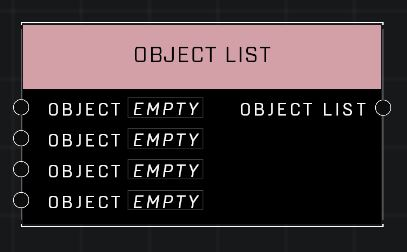

# Object List

## Description
Stores a list of Object References. Objects in list are ordered and unique, meaning adding an object a second time will have no effect.

## Node Type
Nodes fall into two basic categories: Data and Execution. This node supplies Data for an Execution node.

## Inputs
| Input | Type | Required | Description |
|------------------|------------------|----------|--------------------------------------------------------------|
| Object | Object | No | An object to add to this list. |
| Object | Object | No | An object to add to this list. |
| Object | Object | No | An object to add to this list. |
| Object | Object | No | An object to add to this list. |

## Outputs
| Output | Type | Description |
|------------------|------------------|--------------------------------------------------------------|
| Object List | Object List | Contains all of the objects from the input pins. |