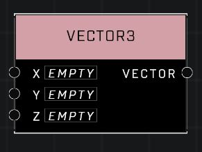

# Vector3

## Description
Stores a Vector of 3 numbers. Can be used to represent positions, rotations, and more. Use Get Vector Axis Value to access the individual elements within an existing vector.

## Node Type
Nodes fall into two basic categories: Data and Execution. This node supplies Data for an Execution node.

## Inputs
| Input | Type | Required | Description |
|------------------|------------------|----------|--------------------------------------------------------------|
| X | Number | No | A number for the X axis of the Vector 3 |
| Y | Number | No | A number for the Y axis of the Vector 3 |
| Z | Number | No | A number for the Z axis of the Vector 3 |

## Outputs
| Output | Type | Description |
|------------------|------------------|--------------------------------------------------------------|
| Vector | Vector3 | The final Vector 3 using the input pins. |