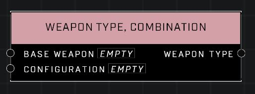

# Weapon Type, Combination

## Description
Creates a new weapon type by combining a base weapon with the configuration traits of another weapon. Not all combo weapon types will work.

## Node Type
Nodes fall into two basic categories: Data and Execution. This node supplies Data for an Execution node.

## Inputs
| Input | Type | Required | Description |
|------------------|------------------|----------|--------------------------------------------------------------|
| Base Weapon | Weapon | Yes | The base weapon to use for this weapon combo. |
| Configuration | Weapon | Yes | The weapon to use for configuration traits to combine. |

## Outputs
| Output | Type | Description |
|------------------|------------------|--------------------------------------------------------------|
| Weapon Type | Weapon Type | The new Weapon Type created by combining the weapons. |

\
\
**Contributors**

AddiCt3d 2CHa0s
