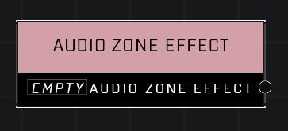

# Audio Zone Effect

## Description
The types of effects applied to players within an Audio Zone

## Node Type
Nodes fall into two basic categories: Data and Execution. This node supplies Data.

## Inputs
| Input | Type | Required | Description |
|------------------|------------------|----------|--------------------------------------------------------------|
| (none) |  |  |  |

## Outputs
| Output | Type | Description |
|------------------|------------------|--------------------------------------------------------------|
| Audio Zone Effect | Audio Zone Effect | Footsteps Muffled, Footsteps Muted |