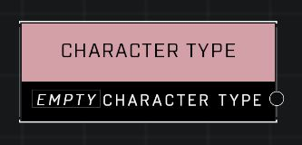

# Character Type

## Description
An AI character type, such as Grunt Conscript A

## Node Type
Nodes fall into two basic categories: Data and Execution. This node supplies Data.

## Inputs
| Input | Type | Required | Description |
|------------------|------------------|----------|--------------------------------------------------------------|
| (none) |  |  |  |

## Outputs
| Output | Type | Description |
|------------------|------------------|--------------------------------------------------------------|
| Character Type | Character Type | See Character Type page for a list of options. |