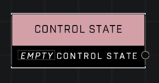

# Control State

## Description
The various states a Generic Zone can exist in

## Node Type
Nodes fall into two basic categories: Data and Execution. This node supplies Data.

## Inputs
| Input | Type | Required | Description |
|------------------|------------------|----------|--------------------------------------------------------------|
| (none) |  |  |  |

## Outputs
| Output | Type | Description |
|------------------|------------------|--------------------------------------------------------------|
| Control State | Control State | See Control State page for a list. |