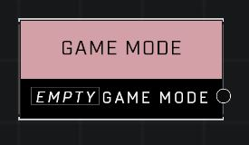

# Game Mode

## Description
A value representing a game mode that you'd select when player Custom Games. Some values liek BTB correspond to multiple game variants.

## Node Type
Nodes fall into two basic categories: Data and Execution. This node supplies Data.

## Inputs
| Input | Type | Required | Description |
|------------------|------------------|----------|--------------------------------------------------------------|
| (none) |  |  |  |

## Outputs
| Output | Type | Description |
|------------------|------------------|--------------------------------------------------------------|
| Game Mode | Game Mode | See Game Modes page for a list of available modes. |