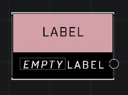

# Label

## Description
Labels that can be applied to objects in their Object Properties window

## Node Type
Nodes fall into two basic categories: Data and Execution. This node supplies Data.

## Inputs
| Input | Type | Required | Description |
|------------------|------------------|----------|--------------------------------------------------------------|
| (none) |  |  |  |

## Outputs
| Output | Type | Description |
|------------------|------------------|--------------------------------------------------------------|
| Label | Boolean | Current value of this node. |