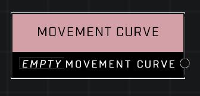

# Movement Curve

## Description
A curve that describes how objects will move. Linear is the default and creates movement that occurs at a constant rate. Generally, Ease-In values will start slowly and pick up speed at the end of the move operation. Ease-Out values will start quickly and slow down at the end of the move operation.

## Node Type
Nodes fall into two basic categories: Data and Execution. This node supplies Data.

## Inputs
| Input | Type | Required | Description |
|------------------|------------------|----------|--------------------------------------------------------------|
| (none) |  |  |  |

## Outputs
| Output | Type | Description |
|------------------|------------------|--------------------------------------------------------------|
| Movement Curve | Boolean | Current value of this node. |