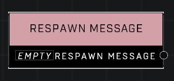

# Respawn Message

## Description
The template of the message displayed to a player with blocked spawns

## Node Type
Nodes fall into two basic categories: Data and Execution. This node supplies Data.

## Inputs
| Input | Type | Required | Description |
|------------------|------------------|----------|--------------------------------------------------------------|
| (none) |  |  |  |

## Outputs
| Output | Type | Description |
|------------------|------------------|--------------------------------------------------------------|
| Respawn Message | Respawn Message | Challenge Failed, Game Over, Out of Lives, Respawning Disabled, You Died |