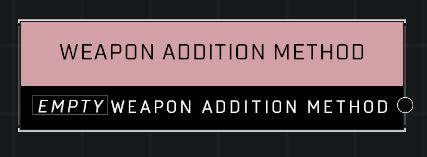

# Weapon Addition Method

## Description
The means by which a weapon is added to a unit

## Node Type
Nodes fall into two basic categories: Data and Execution. This node supplies Data.

## Inputs
| Input | Type | Required | Description |
|------------------|------------------|----------|--------------------------------------------------------------|
| (none) |  |  |  |

## Outputs
| Output | Type | Description |
|------------------|------------------|--------------------------------------------------------------|
| Weapon Addition Method | Weapon Addition Method | Default, If Room, Replace All, Swap Primary, Swap Secondary |